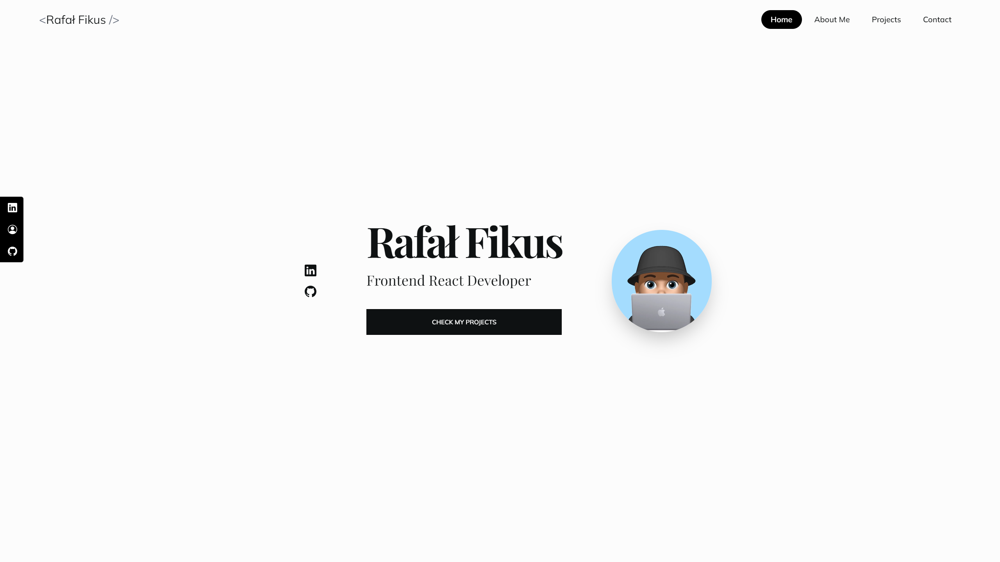
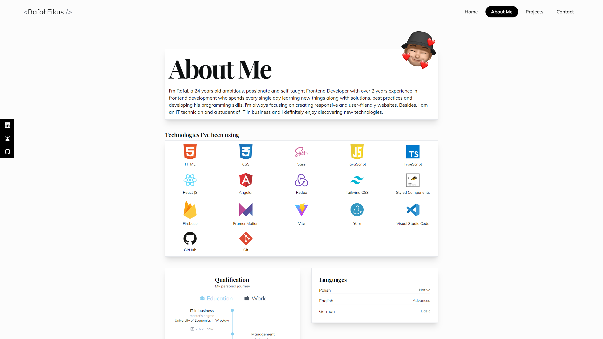
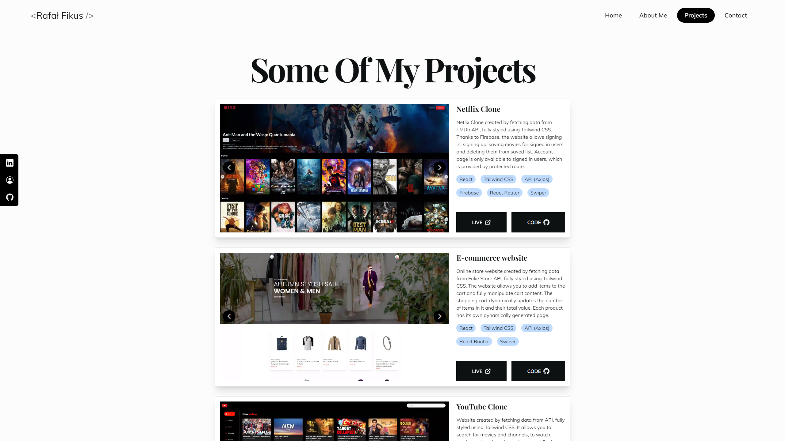
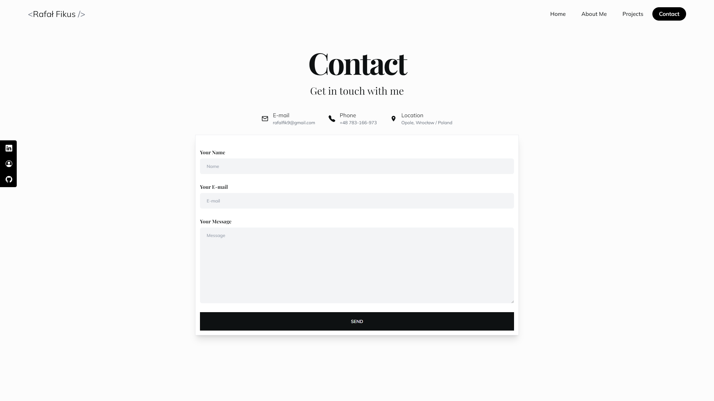

<br/>
<div align="center">
  <a href="">
    
  </a>

  <h1 align="center">Portfolio Website</h1>

  <p align="center">
    <a href="https://rfikus-portfolio.netlify.app/"><strong>Live Website »</strong></a>
    <br/>
    <br/>
  </p>
</div>

<details>
  <summary>Table of Contents</summary>
  <ol>
    <li>
      <a href="#about-project">About Project</a>
    </li>
    <li>
      <a href="#screenshots">Screenshots</a>
    </li>
    <li><a href="#tech-stack">Tech Stack</a></li>
    <li>
      <a href="#installation">Installation</a>
    </li>
  </ol>
</details>
 <br />

## About Project

Basic fully responsive portfolio website built using React JS, TypeScript and designed using Tailwind CSS. About Me page contains basic information about me. Projects Page contains some of the projects I have done. Each project is dynamically generated from a list in which each project is represented by an object. In the same way, the technologies I've been using and those I am currently learning are generated in the About Me page. Screenshots of the projects can be scrolled through using Swiper. Contact Page contains a form, filling it out and submitting it causes an email to be sent to my mailbox. After submitting the form, a message generated with React-Toastify is displayed, depending on success or failure.

## Screenshots






## Tech Stack

- 
- 
- 
- 
- Framer Motion
- EmailJS
- React-Toastify
- Swiper
- React Icons

## Installation

To get started with this project, simply clone the repository:

```bash
git clone https://github.com/Vertori/prtfl-react-ts.git
```

Use the package manager [npm](https://www.npmjs.com/) to install the dependencies.

```bash
npm install
```

After that, run the following command to start the development server:

```bash
npm run dev
```
